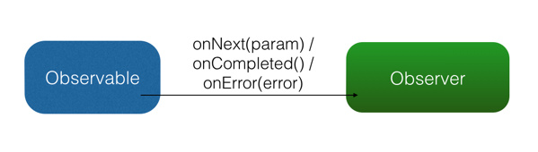

# rxjava 简介
RxJava 在 GitHub 主页上的自我介绍是 "a library for composing asynchronous and event-based programs using observable sequences for the Java VM"（一个在 Java VM 上使用可观测的序列来组成异步的、基于事件的程序的库）。这就是 RxJava ，概括得非常精准。
相较于Handler、AsyncTask而言 会显得更加简洁易懂，而且它具备线程切换调度，可以有效减少handler和thread的使用。

RxJava 的观察者模式

RxJava 有四个基本概念：Observable (可观察者，即被观察者)、 Observer (观察者)、 subscribe (订阅)、事件。Observable 和 Observer 通过 subscribe() 方法实现订阅关系，从而 Observable 可以在需要的时候发出事件来通知 Observer。

与传统观察者模式不同， RxJava 的事件回调方法除了普通事件 onNext() （相当于 onClick() / onEvent()）之外，还定义了两个特殊的事件：onCompleted() 和 onError()。

onCompleted(): 事件队列完结。RxJava 不仅把每个事件单独处理，还会把它们看做一个队列。RxJava 规定，当不会再有新的 onNext() 发出时，需要触发 onCompleted() 方法作为标志。
onError(): 事件队列异常。在事件处理过程中出异常时，onError() 会被触发，同时队列自动终止，不允许再有事件发出。
在一个正确运行的事件序列中, onCompleted() 和 onError() 有且只有一个，并且是事件序列中的最后一个。需要注意的是，onCompleted() 和 onError() 二者也是互斥的，即在队列中调用了其中一个，就不应该再调用另一个。

RxJava 的观察者模式大致如下图：

# 简单实例
   

        例子1
        for(Student student : mList){
            for(Student student2 : mList2){
                if(student.name.equals(student2.name)){
                    Log.i(TAG,"testFor 1 "+student.name);
                }
            }
        }
        列子2
        Observable.from(mList)
                .flatMap(new Func1<Student, Observable<Student>>() {
                    @Override
                    public Observable<Student> call(Student student) {
                        student1 = student;
                        return Observable.from(mList2);
                    }
                })
                .filter(new Func1<Student, Boolean>() {
                    @Override
                    public Boolean call(Student student) {
                        return student1.name.equals(student.name);
                    }
                })
                .subscribeOn(Schedulers.io())
                .observeOn(AndroidSchedulers.mainThread())
                .subscribe(new Action1<Student>() {
                    @Override
                    public void call(Student student) {
                         Log.i(TAG,"testFor 2 "+student.name);
                    }
                });
             